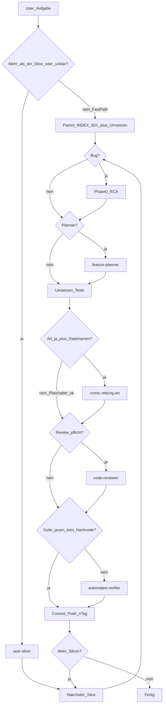

# Entwicklungsablauf (mit Subagenten)

Verbindlicher Ablauf für Features und größere Änderungen am *Schreiblernspiel — 2D Jump & Run*.

**Stack:** Browser · **Konzept:** [`docs/KONZEPT.md`](KONZEPT.md) · **Art:** Stil C · **Git:** nach jedem Slice commit + push + Tag `n<laufnummer>` (fortlaufend, kein SemVer)

**Test-Default:** Headless- und automatisierte Tests reichen. **Physisches Spielen** nur auf **explizite User-Anforderung**.

**Preis-Leistung:** Subagenten nur wenn sie Scope oder Qualität wirklich tragen. Kleine Arbeit läuft im **Parent-Fast-Path** (eine Runde).

**Invarianten (immer):** Pause beim Schreiben/Rechnen · Textfeld + Pen-Tastatur · Hör-Hinweis wiederholbar · Anlauttabelle ohne Autofill · Transform nur `Mech` / `Auto` / `Schiff` / `Flug`

---

## Parent-Fast-Path (Default für kleine Arbeit)

**Kein** `task-slicer`, **kein** `feature-implementer`, **kein** `code-reviewer`, **kein** `automated-verifier`, **kein** `comic-rettung-art`, wenn **alle** gelten:

- klar **ein** Slice (oder Hotfix)
- Docs-only **oder** eine Datei / Konstanten / reiner Rätsel-JSON-Inhalt **oder** offensichtliche Single-System-Änderung
- Scope nicht unklar

**Wer:** Hauptagent.

**Was:** Mini-INDEX (`docs/plans/<kurzname>/INDEX.md`, eine Zeile S01) + Stub mit Feature + In + Nicht → umsetzen → automatisierte Tests (falls Code) → kurzer Selbstcheck (10 Zeilen: Akzeptanz, Suite grün ja/nein) → Git (`n<laufnummer>`).

INDEX trotzdem anlegen. Ohne INDEX keine Lieferung der Gesamtaufgabe.

---

## Phase S — Zerlegung (nur ab Größe)

**Wann:** Aufgabe braucht **zwei oder mehr** Slices **oder** der Scope ist unklar. Sonst Fast-Path: Parent legt S01 selbst an.

**Wer:** Subagent `task-slicer`.

**Was:** Feature-Schritte, keine Prozess-Phasen.

**Packing:** ein Slice = zwei verwandte spieler-sichtbare Inkremente, wenn sie zusammen review- und testbar sind.

**Keine** Slices für Review, Tests, Verify, Git, RCA, „Datei speichern“ vs. „verdrahten“.

**Output:** INDEX + Stub pro Feature (`docs/plans/_SLICE_INDEX.md`, `docs/plans/_SLICE.md`). Optional Art ja/nein **mit Dateinamen** + 2-Bullet-Testplan.

### Zuschnitt (Beispiele)

- Wort-Magie: Seil + Brücke, oder Hör- + Motiv-Modus
- Mathe: Plus + Größer/Kleiner (gemeinsame Pause/Textfeld-Pipeline)
- Transform: Mech + Auto
- Nachzeichnen: Brücke + Leiter
- Editor: Erfassen + Speichern eines Rätseltyps
- Level: ein Abschnitt mit zwei Stationen
- Prozess/Docs: ein Thema = ein Slice

**Zu groß:** ganzes Spiel, alle Rätseltypen, komplette Anlauttabelle, voller Editor + alle Level.

Slices nacheinander: Ablauf 0–4 + Git pro Slice. **Hotfix** = Fast-Path, ein Slice.

---

## Phase 0 — Repro & RCA (bei Fehlern Pflicht)

**Wann:** Bug, Verify-/Test-Fail, Crash, Regression, Review-Finding mit Fehlverhalten — **bevor** Phase 2 dieses Slices.

**Wer:** Hauptagent (Tests/Logs). Ergebnis im Slice („Repro & RCA“) oder `docs/plans/bugs/<kurzname>.md`.

1. Reproduzieren (Schritte, erwartet/tatsächlich, failender Test bevorzugt) → bestätigt oder nicht reproduzierbar (kein Blind-Fix)
2. RCA: Ursache, Nicht-Ursache, Fix-Richtung, Risiken
3. Dokumentieren, dann erst Plan/Implement

**Verboten:** Verdachts-Fixes ohne Repro (außer Hotfix + RCA-Nachzug); unrelated Änderungen; nächsten Slice vor Pass des aktuellen.

Findings aus Phase 3/4 die Bugs sind: erneut Phase 0, dann Fix, dann Review/Verify dieses Slices wiederholen.

---

## Phase 1 — Plan (oft überspringen)

**Wer:** Hauptagent oder `feature-planner`  
**Input/Output:** genau ein Slice-File.

**Skip:** Stub hat Feature + In + Nicht **und** Änderung offensichtlich. Implementer/Parent ergänzt Testplan/Akzeptanz in derselben Datei.

**Planner behalten:** Bugs (RCA), Art mit echten Dateien, Multi-System, unklarer Scope.

Voller Plan (siehe `_TEMPLATE.md`): Ziel, Scope, Systeme, Schritte, Testplan (automatisiert Pflicht), Art-Bedarf mit **konkreten Dateinamen** oder „keine“, Akzeptanz, bei Bugs Repro & RCA.

Ohne Feature+In+Nicht keine Implementierung (außer Hotfix). Bei Bugs ohne Phase 0 keine Phase 2. Planner darf Slices nicht neu schneiden.

---

## Phase 2 — Umsetzen

**Wer:** `feature-implementer` — **außer Fast-Path** (dann Parent).  
INDEX-Zeile zu Beginn `in Arbeit`.

- Nur dieses Slice-File
- Bugs: erst Regressionstest rot, dann Fix grün
- Suite **einmal** grün, Handoff `suite green: yes/no`
- **Art:** `comic-rettung-art` **nur** wenn Slice `Art: ja` **und** eine Dateiliste hat. Sonst CSS/SVG/Platzhalter. Nie „mitdenken“
- Kein Scope auf Nachbarn; kein INDEX `erledigt`

---

## Phase 3 — Code Review

**Wer:** `code-reviewer`

**Pflicht** nur wenn **spielsichtbar und nicht trivial:** Gameplay, Pause/Textfeld/Input, Editor-Logik, Art-Integration, nicht-triviale Bugs.

**Skip (Parent-Selbstcheck reicht):** Docs-Wording, Konstanten, reiner JSON-Rätselinhalt, Fast-Path-Single-File ohne die Systeme oben.

Nicht mit Phase 4 zusammenlegen. Critical/High vor Git; bug-artige Findings → Phase 0.

---

## Phase 4 — Automatisierte Verifikation

**Kein Subagent**, wenn Implementer-/Parent-Handoff `suite green: yes` **und** Review keinen weiteren Code/Art verlangt hat (oder Review geskippt). Dann Pass → Git.

**`automated-verifier` nur wenn:** Handoff fehlt, Suite nicht grün, Review Nachcode verlangt, oder User Verify ausdrücklich will.

Keine doppelte Suite, wenn schon grün gemeldet. Docs-only: Read-through, kein Game-Launch.

Phase 4b (Surface/Pen/manuell) **nur** auf User-Anforderung — sonst kein Blocker.

Pass (oder User-Override) → Git → INDEX `erledigt` → nächster Slice.

**INDEX-Status nur:** `offen` → `in Arbeit` → `erledigt`. Kein Phasen-Churn im Slice-File.

---

## Git — Laufnummer

Nach Pass jedes Slices:

1. commit + push auf den Tracking-Branch
2. Tag `n<N>` setzen und pushen (`git tag n<N> && git push origin n<N>`)

**N** = letzte existierende Tag-Nummer `n*` plus 1. Noch kein Tag → `n1`. Kein SemVer (`v0.1.0` o. Ä.).

---

## Subagenten

| Name | Wann starten |
|------|----------------|
| `task-slicer` | ≥2 Slices oder unklarer Scope — nicht Fast-Path |
| `feature-planner` | Bugs / Art-Dateien / Multi-System / unklar |
| `feature-implementer` | Nicht Fast-Path; ein Slice inkl. Tests |
| `comic-rettung-art` | Nur `Art: ja` + Dateinamen im Slice |
| `code-reviewer` | Spielsichtbar und nicht trivial |
| `automated-verifier` | Suite nicht grün / kein Handoff / Nachcode nach Review / User will Verify |

Orchestration: Hauptagent. Fast-Path oder Slicer, dann pro Slice 0 → (1) → 2 → (3) → (4) → Git.

---

## Hotfix

User sagt „Hotfix“ / „nur schnell fixen“ → Fast-Path, ein Slice. Repro versuchen; RCA kurz im Slice/Commit. Fehlt Repro: kennzeichnen, RCA nachziehen. Review/Verifier nur nach den Skip-Regeln oben (nicht pauschal Pflicht).

---

## Vorlagen

- `docs/plans/_SLICE_INDEX.md` · `docs/plans/_SLICE.md` · `docs/plans/_TEMPLATE.md`
- Spielkonzept: `docs/KONZEPT.md`
